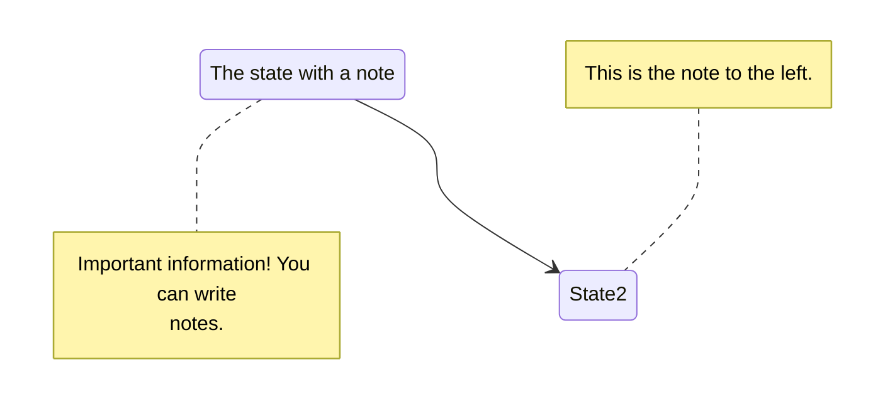

Book ships with several short codes:

# buttons

```tpl
Get Home
Contribute
```

# Columns

```html
{} <!-- begin columns block -->
# Left Content
Lorem markdownum insigne...

<---> <!-- magic separator, between columns -->

# Mid Content
Lorem markdownum insigne...

<---> <!-- magic separator, between columns -->

# Right Content
Lorem markdownum insigne...
{}
```

# Details 
this is a dropdown

```tpl
{}
## Markdown content
Lorem markdownum insigne...
{}
```
```tpl
{}
## Markdown content
Lorem markdownum insigne...
{}
```

# Hints

This is a info/warning/danget box

[info|warning|danger]

```tpl
{}
**Markdown content**  
Lorem markdownum insigne. Olympo signis Delphis! Retexi Nereius nova develat
stringit, frustra Saturnius uteroque inter! Oculis non ritibus Telethusa
{}
```
# tabs

```tpl

{} # MacOS Content {}
{} # Linux Content {}
{} # Windows Content {}

```


# Mermaid Diagrams

check the theme documentation for details

````tpl

````
