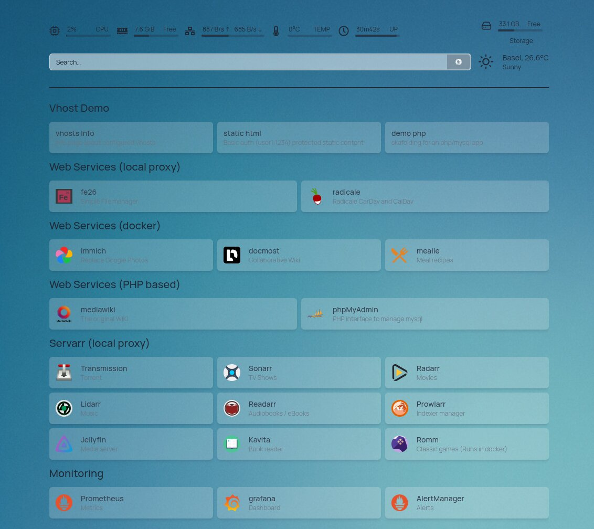

# Ansible Autobott
**Ansible Playbooks for Managing Self-Hosted Services on Debian Hosts**

{}
**Work in progress**  
The documentation is still under development and some parts are incomplete
{}

---

## About

**AutoBott** is a curated set of Ansible playbooks designed to automate the deployment and maintenance of
self-hosted services on Debian-based servers — with limited support for basic desktop setups.

Whether you're running a homelab or managing a lightweight private cloud, AutoBott simplifies system administration, enhances security, and gets your favorite services running in minutes.

###  General System Management & Hardening
* Basic setup: manage the basic setup of your server, users, Locales, hostname etc.
* Monitoring: Use Prometheus, Grafana, SmartD or Monit to monitor and alert on your system status.
* Backup: use borg or goback to automate your backups
* Keep your Samba networks in code as infra

### Web services services setup

* Run a LAMP-like stack with Caddy,PHP-PFM and MariaDB, with good user isolation
* Servarr: install the Servarr Stack
* Personal productivity: Install mediawiki, Docmost or Immich among others
* Protect all the services with Authelia

### Game Server
* Install a Minecraft server

{}
Autobott is only tested on x86 Architecture, don't expect everything to work on other 
architectures, e.g. on a Raspberry PI.

This is because Autobott does download binaries that are not packaged in debian.
{}

---

## Get Started

Check out the [Getting Started Guide](/docs/docs/getting-started/) to set up your first server or simply try
it out on a [vagrant VM](/docs/docs/getting-started/vagrant/).

